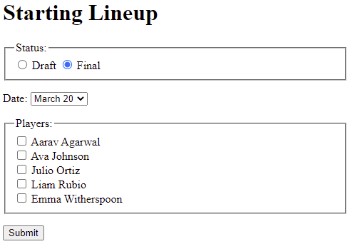

# CS208-starter-code

- Click Use this template, then click Open in a codespace.
- Open the terminal in your codespace.
- Run `npm install` to install the dependencies.
- Run `npm start` to start the server.
- When your application starts, the codespace recognizes the port the application is running on and displays a pop-up message to let you know that the port has been forwarded.
- Click the link in the pop-up to open your application in a new browser tab.


# Citation

I am using ChatGPT 5.3 codex extra high with IDE context on my local installation for this task. 
The prompt was especially easy, as all I did was copy the assignment description verbatim and upload the image. 
I am satisfied with the output as it seems to do everything correctly. 

prompt:

```prompt
Tasks: Create a form that matches the one shown in the image below exactly. 

Guidelines
The form should:

Add an event listener to a function called myLineUp to the submit button. The function myLineUp should print all the data that it received to the console and then concatenate all the information together into one string and display the selections on the web page. You will need to print to the console AND update the HTML page.

Use a <p> to surround related labels, form widgets, and fieldsets

Use a <fieldset> and <legend> with radio buttons for choosing Draft or Final. The radio buttons' name attribute should be "status" with values "Draft" and "Final".

Make the Final radio button checked by default

Add a <label> to each radio button so clicking the label text selects the radio button

Use a drop-down with the following dates: March 20, March 24, April 2, April 6, April 13. The <select> name attribute should be "gameDate", and each <option> should use a value identical to the option's date.

Add a <label> to each checkbox so clicking the label text selects the checkbox

Use a submit <input> with value "Submit"
```

